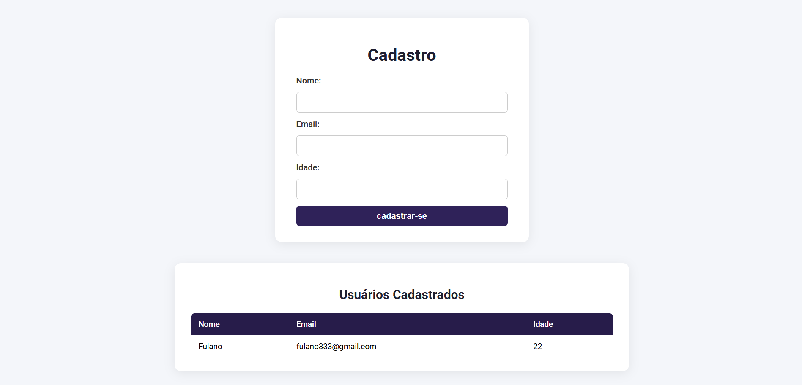

# Formulário de cadastro com NODE.js

Este projeto é um exercício prático focado na validação de competências no desenvolvimento backend com JavaScript. Foi desenvolvido para consolidar a experiência na criação de um servidor funcional capaz de gerenciar a interação básica de um formulário web.

* Node.js: Plataforma base para a execução do servidor.

* Express: Utilizado para definir as rotas (GET e POST) e manipular as requisições HTTP do formulário.

* Path: Módulo nativo empregado para o serviço confiável do arquivo HTML do formulário, garantindo que o caminho seja resolvido       corretamente.

## Screenshot

Aqui temos uma screenshot do projeto:

